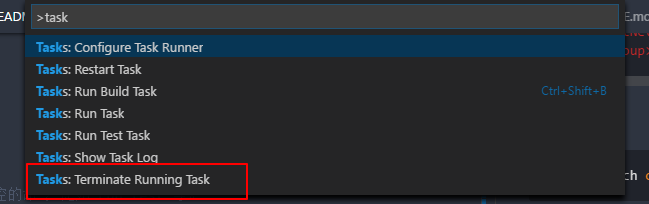

# aspnet-core-mssql-ef-demos

> 这个示例的主要目的是为了了解 `Linq to EF` 生成的sql语句是不是经过优化的，以及一些开发常用的配置项。do what you want.

<!-- TOC -->

- [aspnet-core-mssql-ef-demos](#aspnet-core-mssql-ef-demos)
    - [准备工作](#准备工作)
    - [创建项目](#创建项目)
    - [配置Dbcontext使用log](#配置dbcontext使用log)
    - [配置数据库连接的DI，具体查看startup.cs](#配置数据库连接的di具体查看startupcs)
    - [Demos](#demos)
        - [`HomeController`](#homecontroller)
    - [cli 命令行工具](#cli-命令行工具)
        - [`dotnet`](#dotnet)
        - [`dotnet ef`](#dotnet-ef)
        - [dotnet watch](#dotnet-watch)
        - [To Be Continued](#to-be-continued)

<!-- /TOC -->
## 准备工作

- 一个能够连接的`mssql`服务（我本机用的是`docker Microsoft/mssql-server-linux`的image）为了方便docker的端口都设置成1433.
- 一个数据库 这里用的是`NorthWind` sql 在assets目录可以找到
- `ASP.NET CORE` 需要安装
- 可选（如果你用vscode开发，可以安装https://marketplace.visualstudio.com/items?itemName=ms-mssql.mssql

## 创建项目

- 在一个空白目录创建一个新的`mvc`项目

```sh
dotnet new mvc
```
创建成功后确保可以正常运行，打开浏览器5000端口可以看到默认的页面

```sh
dotnet run
```
- 执行assets下面的sql，创建数据库

- 测试你能连接到数据库

- 实体生成

```sh
# 使用ef工具生成Models,连接字符串修改成自己的。
dotnet ef dbcontext scaffold "Server=localhost;Database=NorthWind;User Id=sa;Password=qtdqQoNOCz42;" Microsoft.EntityFrameworkCore.SqlServer -o Models -f -d
```

## 配置Dbcontext使用log

  <details>
  <summary>依赖注入：loggerFactory</summary>

  ```csharp
  # aspnet-core-mssql-ef-demos/Models/NorthWindContext.cs

  private ILoggerFactory loggerFactory;
  public NorthWindContext(ILoggerFactory loggerFactory)
  {
    this.loggerFactory = loggerFactory;
  }
  ```
  
  </details>
  
  <details>
   <summary>配置optionsBuilder使用UseLoggerFactory</summary>
  
   
    ```csharp
    # 依赖注入：loggerFactory

    ...
    protected override void OnConfiguring(DbContextOptionsBuilder optionsBuilder)
    {
      ...
      optionsBuilder.UseLoggerFactory(loggerFactory);
    }

    ```
  
  </details>


## 配置数据库连接的DI，具体查看startup.cs


## Demos 

### `HomeController`

- Take()

  <details>
  <summary>Index()</summary>

  ```csharp
  public async Task<IActionResult> Index()
  {
    var employees = await _context.Employees.Take(5).AsNoTracking().ToListAsync();

    return View(employees);
  }
  ```

  </details>

  <details>
  <summary>上面的语句查询5条employ的记录，生成的sql语句类似：</summary>

  
  ```sql
  info: Microsoft.EntityFrameworkCore.Storage.IRelationalCommandBuilderFactory[1]
        Executed DbCommand (180ms) [Parameters=[@__p_0='?'], CommandType='Text', CommandTimeout='30']
        SELECT TOP(@__p_0) [e].[EmployeeID], [e].[Address], [e].[BirthDate], [e].[City], [e].[Country], [e].[Extension], [e].[FirstName]
  , [e].[HireDate], [e].[HomePhone], [e].[LastName], [e].[Notes], [e].[Photo], [e].[PhotoPath], [e].[PostalCode], [e].[Region], [e].[Rep
  ortsTo], [e].[Title], [e].[TitleOfCourtesy]
        FROM [Employees] AS [e]
  ```

  </details>

  > `AsNoTracking()` 如果查询的数据在将来不会修改，不需要保存到EF。

- Select() 只查询必要的字段

  <details>
   <summary>About()</summary>
  
   ```csharp
    var orders = _context.Orders.Take(100).Select(o => new Orders { OrderId = o.OrderId, ShipName = o.ShipName }).ToList();
   ```
  
   ```sql
   Executed DbCommand (82ms) [Parameters=[@__p_0='?'], CommandType='Text', CommandTimeout='30']
      SELECT [t].[OrderID], [t].[ShipName]
      FROM (
          SELECT TOP(@__p_0) [o0].*
          FROM [Orders] AS [o0]
      ) AS [t]
   ```
  </details>  

- more demos  


## cli 命令行工具

### `dotnet`

  ```sh
  $ dotnet --help
  
    .NET Command Line Tools (1.0.3)
    Usage: dotnet [host-options] [command] [arguments] [common-options]

    Arguments:
      [command]             The command to execute
      [arguments]           Arguments to pass to the command
      [host-options]        Options specific to dotnet (host)
      [common-options]      Options common to all commands

    Common options:
      -v|--verbose          Enable verbose output
      -h|--help             Show help

    Host options (passed before the command):
      -d|--diagnostics      Enable diagnostic output
      --version             Display .NET CLI Version Number
      --info                Display .NET CLI Info

    Commands:
      new           Initialize .NET projects.
      restore       Restore dependencies specified in the .NET project.
      build         Builds a .NET project.
      publish       Publishes a .NET project for deployment (including the runtime).
      run           Compiles and immediately executes a .NET project.
      test          Runs unit tests using the test runner specified in the project.
      pack          Creates a NuGet package.
      migrate       Migrates a project.json based project to a msbuild based project.
      clean         Clean build output(s).
      sln           Modify solution (SLN) files.

    Project modification commands:
      add           Add items to the project
      remove        Remove items from the project
      list          List items in the project

    Advanced Commands:
      nuget         Provides additional NuGet commands.
      msbuild       Runs Microsoft Build Engine (MSBuild).
      vstest        Runs Microsoft Test Execution Command Line Tool.

  ```
  
> 使用 `dotnet helper command` 查看该 `command` 的更多帮助信息

### `dotnet ef` 

> 在项目中添加命令行引用后使用 `dotnet restore` 安装依赖，该工具提供EntityFramework项目的功能 

```xml
 <ItemGroup>  
    <DotNetCliToolReference Include="Microsoft.EntityFrameworkCore.Tools.DotNet" Version="1.0.0"/>   
  </ItemGroup>   
```
可以用下面的方式查看是否安装成功
```sh
$ dotnet ef

                     _/\__
               ---==/    \\
         ___  ___   |.    \|\
        | __|| __|  |  )   \\\
        | _| | _|   \_/ |  //|\\
        |___||_|       /   \\\/\\

Entity Framework Core .NET Command Line Tools 1.0.0-rtm-10308

Usage: dotnet ef [options] [command]

Options:
  --version        Show version information
  -h|--help        Show help information
  -v|--verbose     Show verbose output.
  --no-color       Don't colorize output.
  --prefix-output  Prefix output with level.

Commands:
  database    Commands to manage the database.
  dbcontext   Commands to manage DbContext types.
  migrations  Commands to manage migrations.

Use "dotnet ef [command] --help" for more information about a command.

```

### dotnet watch

> 开发的时候经常需要重启服务很不方便，使用此工具可以监控文件修改自动重启服务。

```xml
 <ItemGroup>  
       <DotNetCliToolReference Include="Microsoft.DotNet.Watcher.Tools" Version="1.0.0"/>
  </ItemGroup>   
```

使用方式

```sh
dotnet watch command #要监控的命令 比如 run test 等。
```

集成到 `vscode`以本项目为例，在默认生成的 `task.json`文件里面加多一条配置项，我把他设置为是build命令方便可以直接使用快捷键 ctrl+shift+B 运行，要终止这个进程需要在功能菜单里面找到


```diff
--- a/.vscode/tasks.json
+++ b/.vscode/tasks.json
@@ -3,14 +3,27 @@
     "command": "dotnet",
     "isShellCommand": true,
     "args": [],
+    "options": {
+        "env": {
+            "ASPNETCORE_ENVIRONMENT": "Development"
+        }
+    },
     "tasks": [
         {
             "taskName": "build",
             "args": [
                 "${workspaceRoot}/aspnet_core_mssql_ef_demos.csproj"
             ],
-            "isBuildCommand": true,
+            "isBuildCommand": false,
             "problemMatcher": "$msCompile"
+        },
+        {
+            "taskName": "watch",
+            "args": [
+                "run"
+            ],
+            "isBackground": true,
+            "isBuildCommand": true
         }
     ]
 }
```

### To Be Continued